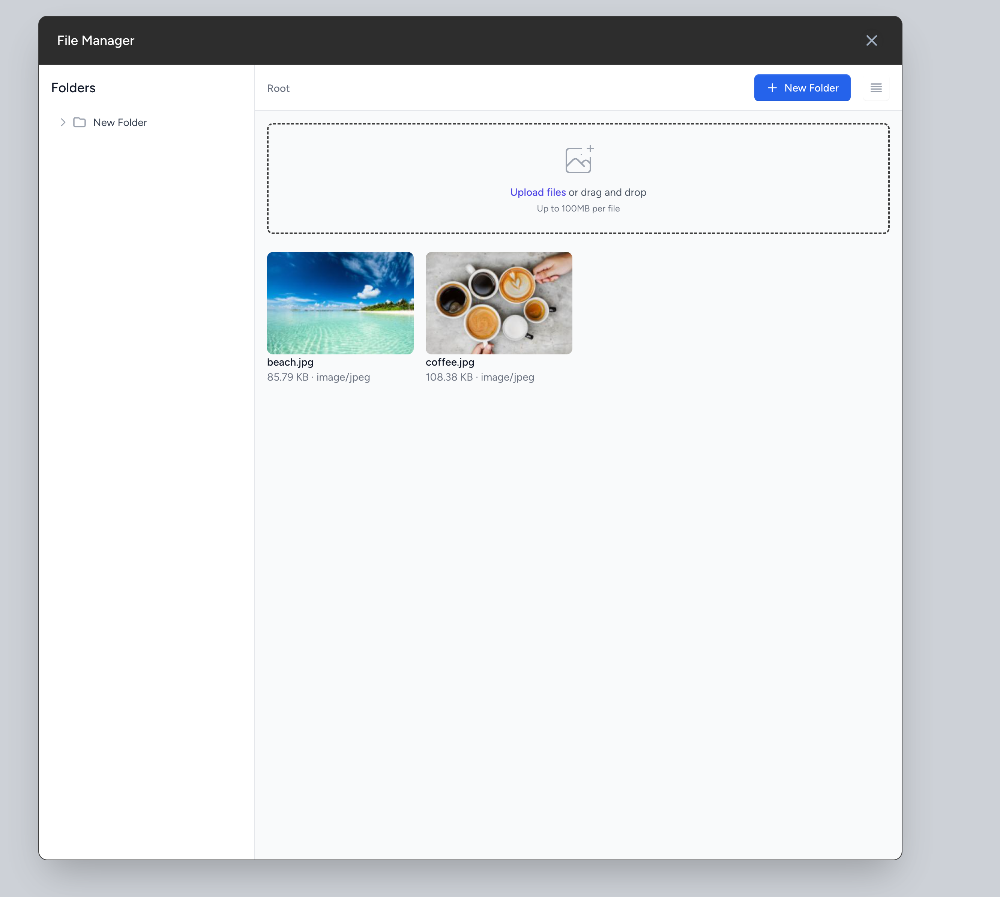

# Laravel Livewire File Manager

[](https://packagist.org/packages/pavlovich4/livewire-filemanager)
[](https://packagist.org/packages/pavlovich4/livewire-filemanager)


A modern, responsive file manager for Laravel using Livewire and Alpine.js. Features include:

- Drag and drop file uploads
- Folder management
- Grid and list views
- File previews
- Image thumbnails
- Copy sharing links
- File downloads

## Important Requirements

- PHP 8.2 or higher
- Laravel 10.0 or higher
- Livewire 3.0 or higher
- spatie/laravel-medialibrary 10.0 or higher

> [!CAUTION]
> **Please be sure to install, configure and run migrations of spatie/laravel-medialibrary package before continue. You can review the installation steps at [spatie/laravel-medialibrary documentation](https://spatie.be/docs/laravel-medialibrary/v11/installation-setup).**

## Installation

1. Install the package via composer:

```bash
composer require pavlovich4/livewire-filemanager
```

2. Publish and run the migrations:

```bash
php artisan vendor:publish --tag="livewire-filemanager-migrations"
php artisan migrate
```

3. Publish the config file:

```bash
php artisan vendor:publish --tag="livewire-filemanager-config"
```

4. Publish and configure the media library:

```bash
php artisan vendor:publish --provider="Spatie\MediaLibrary\MediaLibraryServiceProvider" --tag="medialibrary-config"
```

Update `config/media-library.php`:

```php
 'custom_path_generators' => [
        \Pavlovich4\LivewireFilemanager\Models\File::class => \Pavlovich4\LivewireFilemanager\Support\CustomPathGenerator::class,
        // or
        // 'model_morph_alias' => PathGenerator::class
    ],
```

5. Create the symbolic link for public storage:

```bash
php artisan storage:link
```

> [!IMPORTANT]
> This package requires Tailwind CSS along with the @tailwindcss/aspect-ratio and @tailwindcss/forms plugins to be installed and configured in your project.

6. Update your Tailwind CSS configuration in `tailwind.config.js`:

```js
module.exports = {
  // ...
  content: [
    // ...
    './vendor/pavlovich4/livewire-filemanager/resources/views/**/*.blade.php',
  ],
  // ...
  plugins: [
    // ...
    require('@tailwindcss/forms'),
    require('@tailwindcss/aspect-ratio'),
  ],
};
```

## Usage

1. Add the file manager component to your layout:

```blade

<livewire:file-manager />
{{-- Or --}}
@livewire('file-manager')
```

2. Include the style blade directive in the head tag of your layout:

```blade
@livewireFileManagerStyle
```

3. Include the scripts directive at the end of your body:

```blade
@livewireFileManagerScript
```

4. Trigger the file manager from any element using the `data-trigger="filemanager"` attribute:

```html
<!-- Basic trigger -->
<button data-trigger="filemanager">Open File Manager</button>
```

## Configuration

The package configuration file (`config/livewire-filemanager.php`) allows you to:

```php
return [
    // Storage disk to use (default: 'public')
    'disk' => 'public',

    // Media library configuration
    'media' => [
        'path_generator' => Pavlovich4\LivewireFilemanager\Support\CustomPathGenerator::class,
    ],
];
```

## Key Features

### File Upload

- Drag and drop support
- Multiple file upload
- Progress indicator
- File type validation
- Size limits (configurable)

### Folder Management

- Create folders
- Delete folders (with confirmation)
- Rename folders
- Nested folders
- Folder navigation

### File Operations

- Preview files
- Download files
- Delete files
- Rename files
- Copy share links
- File icons based on type

### UI Features

- Grid/List view toggle
- Breadcrumb navigation
- Responsive design
- Loading states
- Error handling

### Interface Screenshot



## Contributing

Please see [CONTRIBUTING](CONTRIBUTING.md) for details.

### Security

If you discover any security related issues, please email pavlovebiokou@gmail.com instead of using the issue tracker.

## Credits

- [Pavlove Biokou](https://github.com/pavlovich4)
- [All Contributors](../../contributors)

## License

The MIT License (MIT). Please see [License File](LICENSE.md) for more information.
